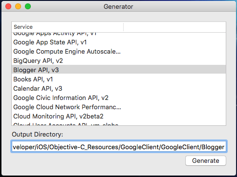

# GoogleServiceGenerator
## Introduction
This is the companion to [GoogleAPISwiftClient](https://github.com/mattwyskiel/GoogleAPISwiftClient), my rewrite of Google's API Client for Apple platforms. This basically generates the code of the individual services, based on the schemas provided by the [Discovery API](https://developers.google.com/discovery/?hl=en) and on the [core classes](https://github.com/mattwyskiel/GoogleAPISwiftClient/tree/master/GoogleClient) of GoogleAPISwiftClient.

## Functionality

It is a simple OS X app that lists all the services Google provides APIs for, and can generate Swift classes for the selected service that fit right in with [GoogleAPISwiftClient](https://github.com/mattwyskiel/GGoogleAPISwiftClient)

## There Will Be Bugs
This is still in the early stages, as [GoogleAPISwiftClient](https://github.com/mattwyskiel/GGoogleAPISwiftClient) is still in the early stages. There will be bugs in code generation. The one service I have been testing on as I've initially written the app is Blogger API, v3, and I've been able to generate code for that service that generates no compiler errors (meaning: it works!!) I can now perform more broad testing with many different services. My goal is for my library to support all the same services that Google's official client library does.

That's where you can help. Issues and Pull Requests are welcome, and even starring this project helps me know that it is worth working on.

## To-Do
- [x] Implement base functionality that is able to at least generate classes for one service (I chose Blogger).
- [ ] Have the app generate in-line documentation for everything
- [ ] Make sure it works with, at a minimum, the same services that Google's library works with.
  - [ ] AdExchange Buyer
  - [ ] AdExchange Seller
  - [ ] AdSense
  - [ ] AdSense Host
  - [ ] Analytics
  - [x] Blogger
  - [ ] Books
  - [ ] Calendar
  - [ ] Civic Info
  - [ ] Cloud Save (AppState)
  - [ ] Cloud Storage
  - [ ] Compute Engine
  - [ ] DoubleClick Bid Manager
  - [ ] Drive
  - [ ] Fitness
  - [ ] Gmail
  - [ ] Maps Engine
  - [ ] Mirror for Google Glass
  - [ ] Groups Settings
  - [ ] Plus
  - [ ] Plus Domains
  - [ ] Spectrum Database
  - [ ] QPX Express
  - [ ] Tasks
  - [ ] URL Shortener
  - [ ] Webmaster Tools
  - [ ] YouTube

## License
This software is licensed under the Apache Software License v2.0. see the LICENSE file for more details.
